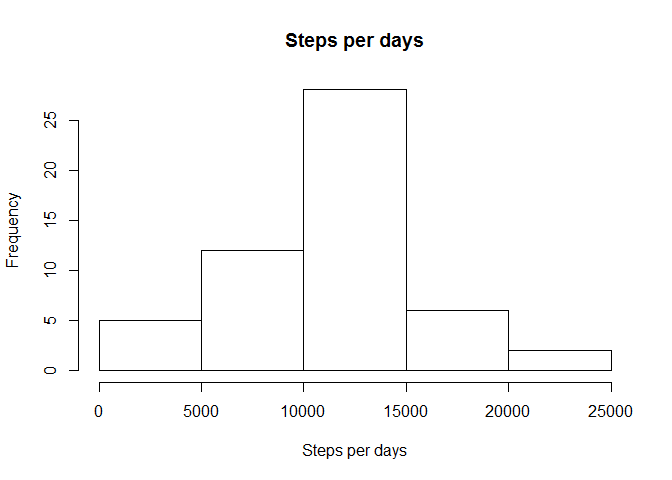
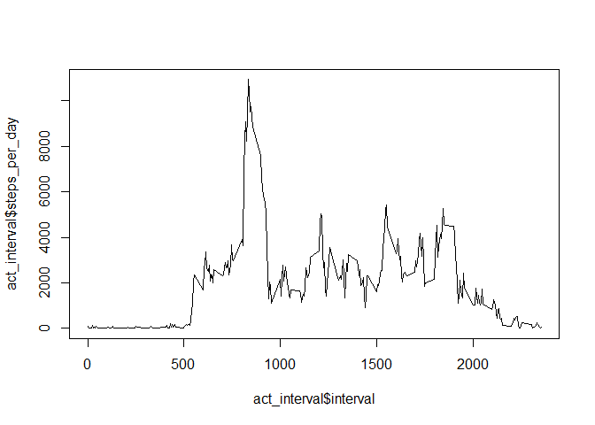
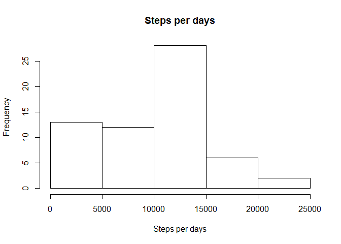
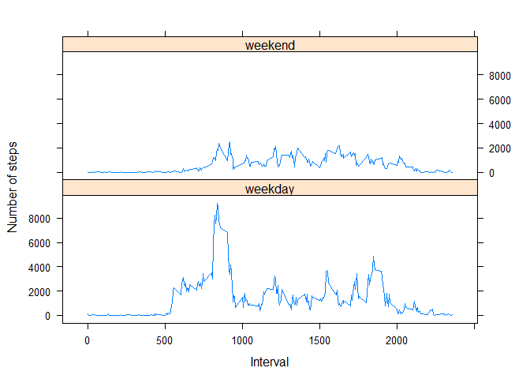

# Reproducible Research: Assignment 1

**Loading and preprocessing the data**

```r
library(dplyr)
library(lattice)
act <- read.csv("activity.csv", sep=",", header=TRUE)
```


1. Calculate the total number of steps taken per day

```r
act_sum <- summarise(group_by(act, date), steps_per_day= sum(steps))
```

2. Ploting the Histogram:


```r
act_sum <- summarise(group_by(act, date), steps_per_day= sum(steps))
hist(act_sum$steps_per_day, main = "Steps per days", xlab = "Steps per days")
```

<!-- -->


3. Calculate and report the mean and median of the total number of steps taken per day:

+ Mean:

```r
mean(act_sum$steps_per_day,na.rm=TRUE)
```

```
## [1] 10766.19
```


+ Median:

```r
median(act_sum$steps_per_day,na.rm=TRUE)
```

```
## [1] 10765
```


**What is the average daily activity pattern?**

1. Make a time series plot (i.e. type = "l") of the 5-minute interval (x-axis) and the average number of steps taken, averaged across all days (y-axis)


```r
act_interval <- summarise(group_by(act, interval), steps_per_day= sum(steps, na.rm=TRUE))
plot(act_interval$interval, act_interval$steps_per_day, type="l" )
```

<!-- -->


2. Which 5-minute interval, on average across all the days in the dataset, contains the maximum number of steps?

```r
filter(act_interval, steps_per_day == max(act_interval$steps_per_day))$interval
```

```
## [1] 835
```

**Imputing missing values**

1. Calculate and report the total number of missing values in the dataset 

```r
sum(!complete.cases(act))
```

```
## [1] 2304
```

2. Create a new dataset that is equal to the original dataset but with the missing data filled in.
+ *Approach: Imputing missing values by median for the specific interval*

```r
act_means <-rename(summarise(group_by(act, interval), steps_median= median(steps, na.rm=TRUE)),key=interval) 
act_cleaned <- cbind(act,act_means, by.x=act$interval, by.y=act_means$key)
act_cleaned <- group_by(act_cleaned, interval)
act_cleaned <- mutate(act_cleaned, steps = ifelse(is.na(steps),steps_median, steps))
```

3. Make a histogram of the total number of steps taken each day and Calculate and report the mean and median total number of steps taken per day. 


```r
act_sum_cleaned <- summarise(group_by(act_cleaned, date), steps_per_day= sum(steps))
hist(act_sum_cleaned$steps_per_day, main = "Steps per days", xlab = "Steps per days")
```

<!-- -->


**Are there differences in activity patterns between weekdays and weekends?**

1. Create a new factor variable in the dataset with two levels - "weekday" and "weekend" indicating whether a given date is a weekday or weekend day.


```r
weekdays <- c("Sunday", "Monday", "Tuesday", "Wednesday", "Thursday", "Friday", "Saturday")
act_cleaned$day <- weekdays[as.POSIXlt(act_cleaned$date)$wday + 1]
act_cleaned <- mutate(act_cleaned, day_type = ifelse(day=='Saturday' | day=='Sunday' ,'weekend', 'weekday'))
act_sum_cleaned <- summarise(group_by(act_cleaned, interval, day_type), steps_per_day= sum(steps))
```

2. Make a panel plot containing a time series plot (i.e. type = "l") of the 5-minute interval (x-axis) and the average number of steps taken, averaged across all weekday days or weekend days (y-axis).


```r
xyplot(steps_per_day ~ interval | day_type, 
        act_sum_cleaned,
        layout=c(1,2),
        type ='l',
        ylab="Number of steps",
        xlab="Interval")
```

<!-- -->

